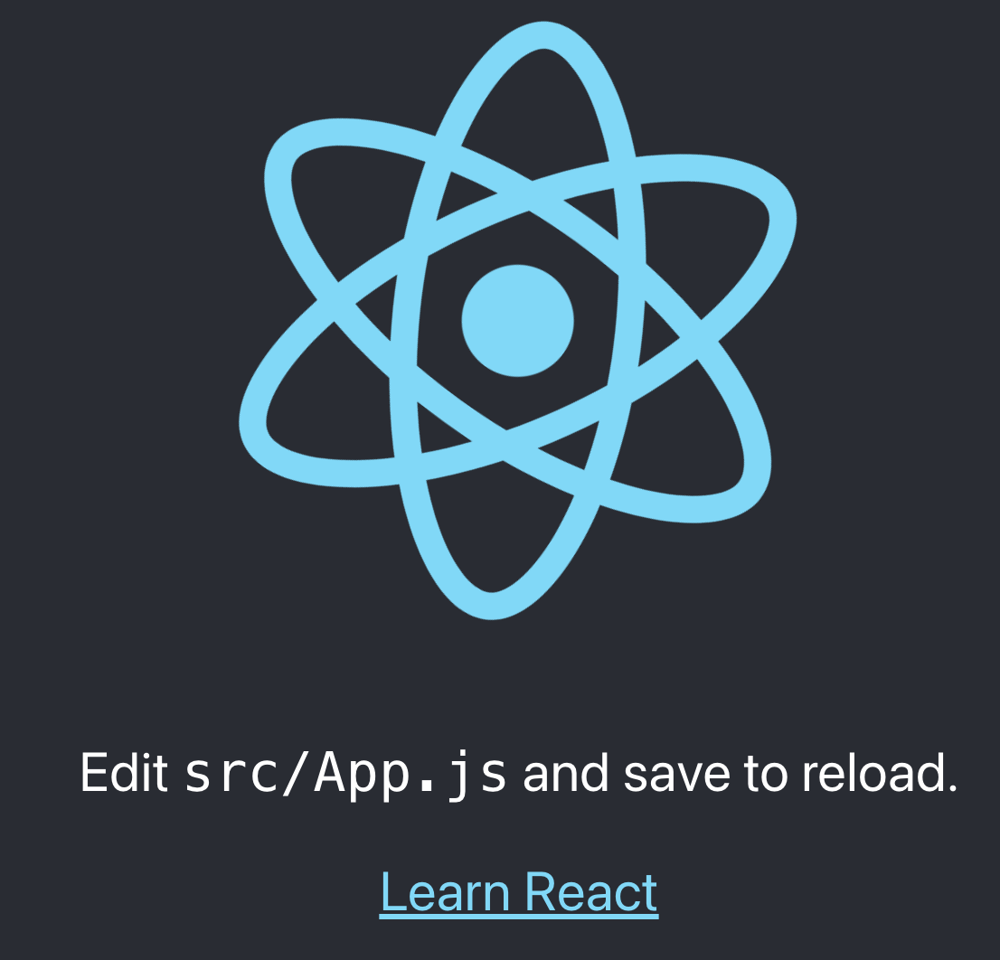

# Create The First App

To start with React you need to have the [node](https://nodejs.org/) and [npm](https://npmjs.com/) in your computer.

In your terminar run those commands in the folder you want to create your first app:

```
npx create-react-app hello-world # the magic command to create a new app
cd hello-world # enter in new directory of you app
npm start # run you new app in the default browser
```

After running those commands should open a new tab in your browser that looked like this:


Nice you build your first app!

You can just remove everything inside the `<div className="App">` in the `src/App.js` and change to this:
```jsx live showLines
<div className="App">
	<h1>Hello World!</h1>
</div>
```
